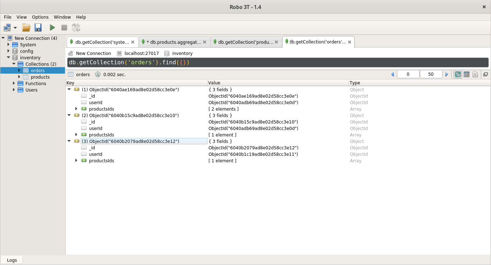

## 1. Create database named: FacultySystemDB. 

## 2. Create collection (student) that has:
	● FirstName: string, LastName: string, Age: Number, Faculty: An object that
	has Name and Address
	● Grades: An array of objects, each object has: CourseName, Grade, Pass
	(Boolean).
	● IsFired: Boolean
 

## 3. Insert 3 (at least) documents in Student collection with different values.
	● Try inserting one record each time
	● Try inserting many students using one insert statement.
 

## 4. Retrieve the following data:
	● All Students.
	● Student with specific First Name.
	● Students who his First Name=Ahmed, or Last Name= Ahmed.
	● Students that their First name isn't "lola".
	● Students with Age more than or equal to 21, and their faculty isn't NULL.
	● Display student with specific First Name, and display his First Name, 
	  Last name, IsFired fields only.
   

## 5. Update the student with specific FirstName, and change his LastName.

## 6. Delete Fired students.

## 7. Delete all students collection.

## 8. Delete the whole DB.

## - Import inventory database.

## - Display number of products per category.

## - Display max category products price.

## - Display user ahmed orders populated with product.

## - Get user ahemd highest order price

## - import books.json.

## - Running aggregation queries that use multiple stages ($match, $group, $count, $skip, $limit, $lookup, $sortByCount etc).

*filter books with more than 600 pages*

*the total number of books in each category*

*count the total number of books*

